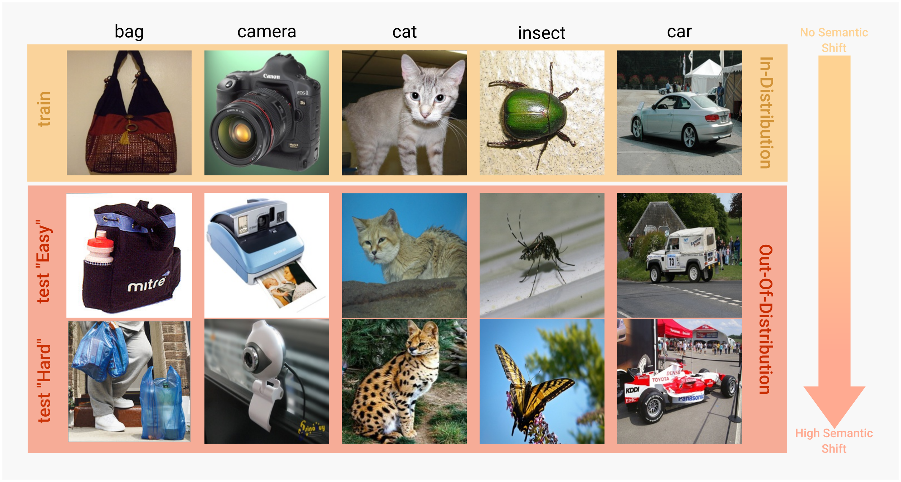
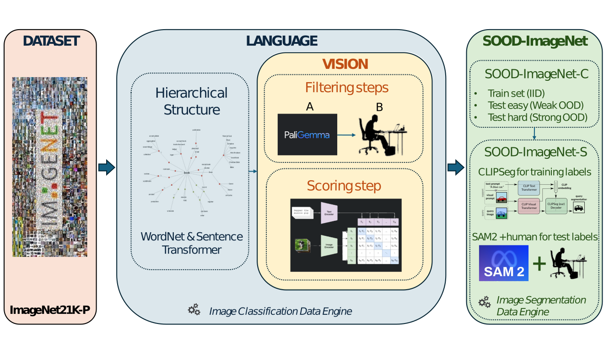

# SOOD-ImageNet: a Large-Scale Dataset for Semantic Out-Of-Distribution Image Classification and Semantic Segmentation

**ABSTRACT:**

Out-of-Distribution (OOD) detection in computer vision is a crucial research area, with related benchmarks playing a vital role in assessing the generalizability of models and their applicability in real-world scenarios. However, existing OOD benchmarks in the literature suffer from two main limitations: (1) they often overlook semantic shift as a potential challenge, and (2) their scale is limited compared to the large datasets used to train modern models. To address these gaps, we introduce SOOD-ImageNet, a novel dataset comprising around 1.6M images across 56 classes, designed for common computer vision tasks such as image classification and semantic segmentation under OOD conditions, with a particular focus on the issue of semantic shift. We ensured the necessary scalability and quality by developing an innovative data engine that leverages the capabilities of modern vision-language models, complemented by accurate human checks.



## Citation

If you use this dataset in your research, please cite the following paper:

``` bibtex
@article{SOOD-ImageNet,
  title={SOOD-ImageNet: a Large-Scale Dataset for Semantic Out-Of-Distribution Image Classification and Semantic Segmentation},
  }
```

## Installation

#### Manual Installation
```commandline
git clone https://github.com/bach05/SOODImageNet.git
cd SOODImageNet
pip install torch==2.3.1 torchvision==0.18.1 torchaudio==2.3.1 
pip install -r requirements.txt
```
#### Installation via pip
```commandline
git clone https://github.com/bach05/SOODImageNet.git
cd SOODImageNet
pip install -e .
```   

---
# DATASET USAGE

We release the dataset used in the paper "*SOOD-ImageNet: a Large-Scale Dataset for Semantic Out-Of-Distribution Image Classification and Semantic Segmentation*" for further experiments.  

## Download ImageNet-21K-P

The images can be obtained from the official website: [Download ImageNet](http://www.image-net.org/). 

We used IMAGENET-21K-P dataset. After the download, your file system should look like: 

```
\download_root
   └── imagenet21k_resized
       ├── imagenet21k_train
       │   ├── n00005787
       │   ├── n02105162
       │   └── ... 
       └── imagenet21k_val
           └── ...
```

## Download of SOOD-ImageNet lists

The splits and the labels are available as `.txt` file lists.
The lists are available in the `lists.zip` file of this repository. Just run:
```commandline
unzip lists.zip
```

## Download segmentation masks

The segmentation masks are given as PNG files of shape `HxW` where each pixel is an integer representing the class ID (0 for background).

**Download the segmentation masks from the following links**: [TRAIN IID](https://drive.google.com/file/d/13o1dMAa56TqOTHyOf4gf6dFPheARqpoC/view?usp=sharing) | [TEST EASY OOD](https://drive.google.com/file/d/1AppoFP8EsPMv3pjwkmKH8ENm_FAys7UG/view?usp=drive_link) | [TEST HARD OOD](https://drive.google.com/file/d/1RqJSUjdWniBDG3dXmaF_PTbaEDQE2FEk/view?usp=drive_link)

## Use the dataset in your project

We provide torch datasets to load the images and labels for the image classification and semantic segmentation tasks in the `utils` folder.

If everything is set up correctly, you can run the following code to test the datasets:
```commandline
python check_loader.py --base_path download_root
```
You easily import the datasets in your project. For example, to load the image classification dataset:

```python
from SOODImageNet.utils.SOODImageNetDataset import get_loaders, SOODImageNetC, SOODImageNetS
```
**TO DO**: add example code when you download the repo in your environment

### Additional details

<details>
  <summary>CLICK TO EXPAND</summary>

The `lists.zip` compressed folder contains 2 folders. 

***For the image classification task***. The folder `classification` contains the following files: 
- `classification/train_iid.txt`, with the images we used for the *IID training*
- `classification/test_easy_ood.txt`, with the images we used for *OOD test* with a smaller semantic shift
- `classification/test_hard_ood.txt`, with the images we used for *OOD test* with a larger semantic shift

Each line of the list is structured as follows: 
```
imagenet21k_train/[synset_folder]/[image_file].JPG [class_ID] [superclass_name] [subclass_name]
```

***For the semantic segmentation task***. The folder `segmentation` contains the following files: 
- `segmentation/train_iid.txt`, with the images we used for the *IID training*
- `segmentation/test_easy_ood.txt`, with the images we used for *OOD test* with a smaller semantic shift
- `segmentation/test_hard_ood.txt`, with the images we used for *OOD test* with a larger semantic shift

Each line of the list is structured as follows: 
```
imagenet21k_train/[synset_folder]/[image_file].JPG output_test_easy_sam2/[synset_folder]/[image_file]_mask.png [class_ID] [superclass_name] [subclass_name]
```
</details>
---

# CREATE A CUSTOM SOOD DATASET

If you would like to use the data engine to create your own lists from scratch, you can follow the instructions below.



## Before using

Download PaliGemma model from [Hugging Face](https://huggingface.co/google/paligemma-3b-mix-224) and save it in the `hf_models` folder:
```commandline
git lfs install
mkdir hf_models
cd hf_models
git clone https://huggingface.co/google/paligemma-3b-mix-224
```
Since requirements are heavy for the data engine, we proved them as a separate file. You can install them by running:
```commandline
pip install -r requirements.txt
```

## Usage

*NOTE: tested on RTX 4090 24GB, Pytorch 2.3.1, CUDA 11.8, Python 3.10.12*

### Classification Dataset Creation

We encapsulated the dataset creation process in the `sood_c_dataset_creation.sh` script. The parameters are the following:
1.  `data_id`: symbolic name to identify the intermediate files
2.  `root_imagenet`: the path to the ImageNet-21K-P dataset
3. `batch_size`: the batch size to use for the CLIP score computation
```commandline
chmod +x sood_c_dataset_creation.sh
./sood_c_dataset_creation.sh sood_imagenet download_root/imagenet21k_resized 512
```
Please, not that human interventions are required during the process. 

For a detailed explanation of the process, please refer to the following scripts:

<details>
  <summary>CLICK TO EXPAND</summary>

1. `cluster_imagenet.py`, contains the code to create the hierarchical structure of ImageNet-21K-P using WordNet and Sentence Transformer. Needs the following files:
   - `data_class_lists/imagenet_cls.yaml`, contains class names for each synset
```commandline
python cluster_imagenet.py 
```

2. `vlm_superclass_building.py`, contains the code to create associate the sub-classes to the proper super-class. Needs the following files:
   - `data_class_lists/imagenet_cls.yaml`, contains class names for each synset
   - `data_class_lists/selected_classes.yaml`, contains the selected super-classes for the SOOD-ImageNet dataset (note that you can define your own classes if you like, but it is not guaranteed to have all of them in the final dataset due to the filtering process)
```commandline
python vlm_superclass_building.py --data_id sood_imagenet --root_imagenet download_root/imagenet21k_resized 
```
3. `human_check_tool.py`, contains the code to perform the human checks on the images. You can interrupt the labelling and resume it. 
```commandline
python human_check_tool.py --data_id sood_imagenet 
```

4. `check_replicas.py`, contains the code to check for replicated sub-classes each super-class. The user is asked to select in which super-class to keep the sub-class.
```commandline
python check_replicas.py --data_id sood_imagenet 
```

5. `check_scores.py`, contains the code to filter the super-classes with a few sub-classes. 
```commandline
python check_scores.py --data_id sood_imagenet --min_num_subclasses 10
```

6. `clip_score_generation.py`: contains the code to compute correlation scores with CLIP
```commandline
python clip_score_generation.py --data_id sood_imagenet --root_imagenet download_root/imagenet21k_resized --batch_size 512
```

7. `outliers_detection.py`: contains the code to detect outliers in the score distribution, useful to remove spurious images in a class
```commandline
python outliers_detection.py 
```
8. `dataset_split.py`: contains the code to split the dataset in IID (train), test easy OOD and test hard OOD
```commandline
python dataset_split.py --root_imagenet download_root/imagenet21k_resized --p_value_1 40 --p_value_2 20
```
</details>

### Segmentation Dataset Creation

---

# CLASSIFICATION EXPERIMENTS

**TO BE RELEASED**

---

# SEGMENTATION EXPERIMENTS

**TO BE RELEASED**


